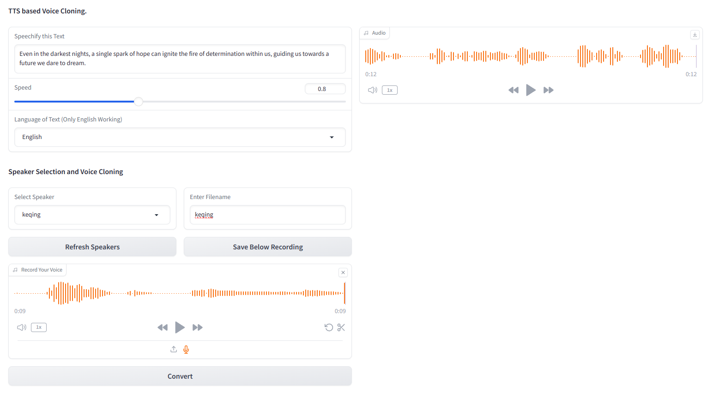

# XTTS-2-UI: A User Interface for XTTS-2 Text-Based Voice Cloning

This repository contains the essential code for cloning any voice using just text and a 10-second audio sample of the target voice. XTTS-2-UI is simple to setup and use. [Example Results 🔊](#examples)

Works in [16 languages](#language-support) and has in-built voice recording/uploading.

## Model 
The model used is `tts_models/multilingual/multi-dataset/xtts_v2`. For more details, refer to [Hugging Face - XTTS-v2](https://huggingface.co/coqui/XTTS-v2) and its specific version [XTTS-v2 Version 2.0.2](https://huggingface.co/coqui/XTTS-v2/tree/v2.0.2).

<h1 align="center">    
  </a>  
</h1>

## Table of Contents

- [XTTS-2-UI: A User Interface for XTTS-2 Text-Based Voice Cloning](#xtts-2-ui-a-user-interface-for-xtts-2-text-based-voice-cloning)
  - [Model](#model)
  - [Table of Contents](#table-of-contents)
  - [Setup](#setup)
  - [Inference](#inference)
  - [Target Voices Dataset](#target-voices-dataset)
  - [Sample Audio Examples:](#sample-audio-examples)
  - [Language Support](#language-support)
  - [Notes](#notes)
  - [Credits](#credits)

## Setup

To set up this project, follow these steps in a terminal:

1. **Clone the Repository**

    - Clone the repository to your local machine.
      ```bash
      git clone https://github.com/pbanuru/xtts2-ui.git
      cd xtts2-ui
      ```

2. **Create a Virtual Environment:**
   - Run the following command to create a Python virtual environment:
     ```bash
     python -m venv venv
     ```
   - Activate the virtual environment:
     - Windows:
       ```bash
       # cmd prompt
       venv\Scripts\activate
       ```
       or
       
       ```bash
       # git bash
       source venv/Scripts/activate
       ```
     - Linux/Mac:
       ```bash
       source venv/bin/activate
       ```

3. **Install PyTorch:**
   
   - If you have an Nvidia CUDA-Enabled GPU, choose the appropriate PyTorch installation command:
     - Before installing PyTorch, check your CUDA version by running:
       ```bash
       nvcc --version
       ```
     - For CUDA 12.1:
       ```bash
       pip install torch torchvision torchaudio --index-url https://download.pytorch.org/whl/cu121
       ```
     - For CUDA 11.8:
       ```bash
       pip install torch torchvision torchaudio --index-url https://download.pytorch.org/whl/cu118
       ```
   - If you don't have a CUDA-enabled GPU,:
     Follow the instructions on the [PyTorch website](https://pytorch.org/get-started/locally/) to install the appropriate version of PyTorch for your system.

4. **Install Other Required Packages:**
   - Install direct dependencies:
     ```bash
     pip install -r requirements.txt
     ```
   - Upgrade the TTS package to the latest version:
     ```bash
     pip install --upgrade TTS
     ```


     

After completing these steps, your setup should be complete and you can start using the project.

Models will be downloaded automatically upon first use.

Download paths:
- MacOS: `/Users/USR/Library/Application Support/tts/tts_models--multilingual--multi-dataset--xtts_v2`
- Windows: `C:\Users\ YOUR-USER-ACCOUNT \AppData\Local\tts\tts_models--multilingual--multi-dataset--xtts_v2`
- Linux: `/home/${USER}/.local/share/tts/tts_models--multilingual--multi-dataset--xtts_v2`


## Inference
To run the application:

```
python app.py
```
On initial use, you will need to agree to the terms:

```
[XTTS] Loading XTTS...
 > tts_models/multilingual/multi-dataset/xtts_v2 has been updated, clearing model cache...
 > You must agree to the terms of service to use this model.
 | > Please see the terms of service at https://coqui.ai/cpml.txt
 | > "I have read, understood and agreed to the Terms and Conditions." - [y/n]
 | | >
 ```

If your model is re-downloading each run, please consult [Issue 4723 on GitHub](https://github.com/oobabooga/text-generation-webui/issues/4723#issuecomment-1826120220).

## Target Voices Dataset
The dataset consists of a single folder named `targets`, pre-populated with several voices for testing purposes.

To add more voices (if you don't want to go through the GUI), create a 24KHz WAV file of approximately 10 seconds and place it under the `targets` folder. 
You can use yt-dlp to download a voice from YouTube for cloning:
```
yt-dlp -x --audio-format wav "https://www.youtube.com/watch?"
```


## Sample Audio Examples:

| Language | Audio Sample Link |
|----------|-------------------|
| English  | [▶️](demo_info/Rogger_sample_en.wav) |
| Russian  | [▶️](demo_info/Rogger_sample_ru.wav) |
| Arabic   | [▶️](demo_info/Rogger_sample_aa.wav) |

## Language Support
Arabic, Chinese, Czech, Dutch, English, French, German, Hungarian, Italian, Japanese[ (see setup)](#notes), Korean, Polish, Portuguese, Russian, Spanish, Turkish

## Notes
If you would like to select **Japanese** as the target language, you must install a dictionary.
```bash
# Lite version
pip install fugashi[unidic-lite]
```
or for more serious processing:
```bash
# Full version
pip install fugashi[unidic]
python -m unidic download
```
More details [here](https://github.com/polm/fugashi#installing-a-dictionary).


## Credits
1. Heavily based on https://github.com/kanttouchthis/text_generation_webui_xtts/ 
